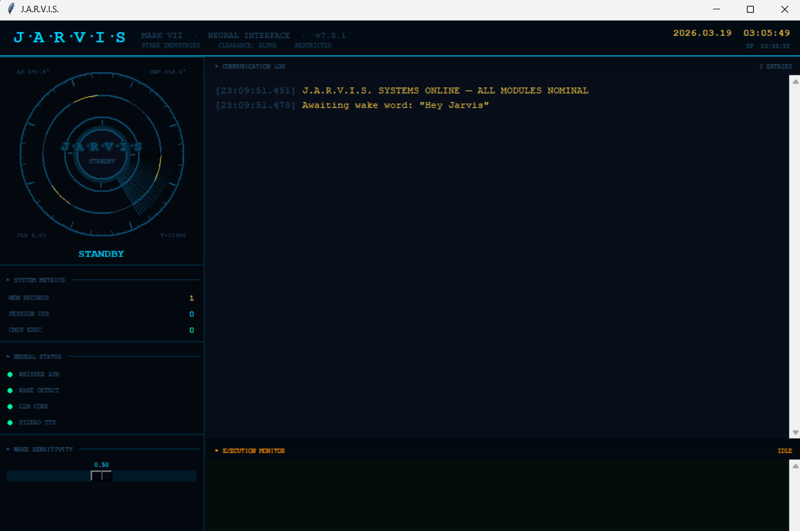
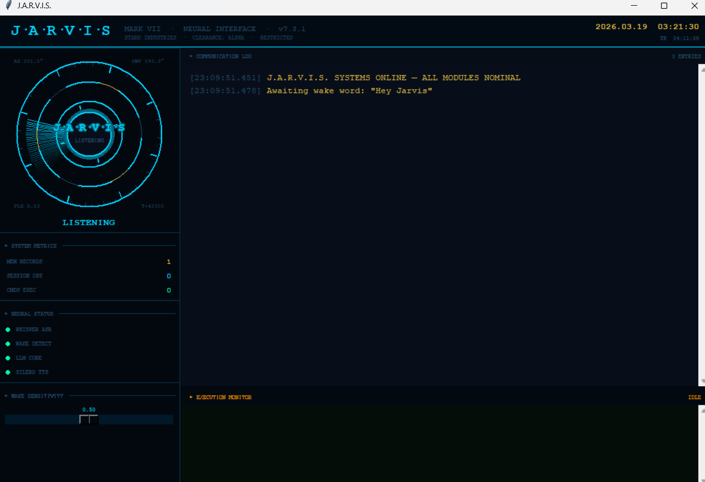
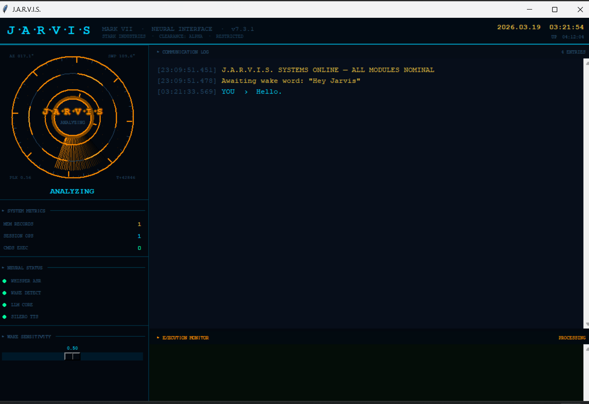
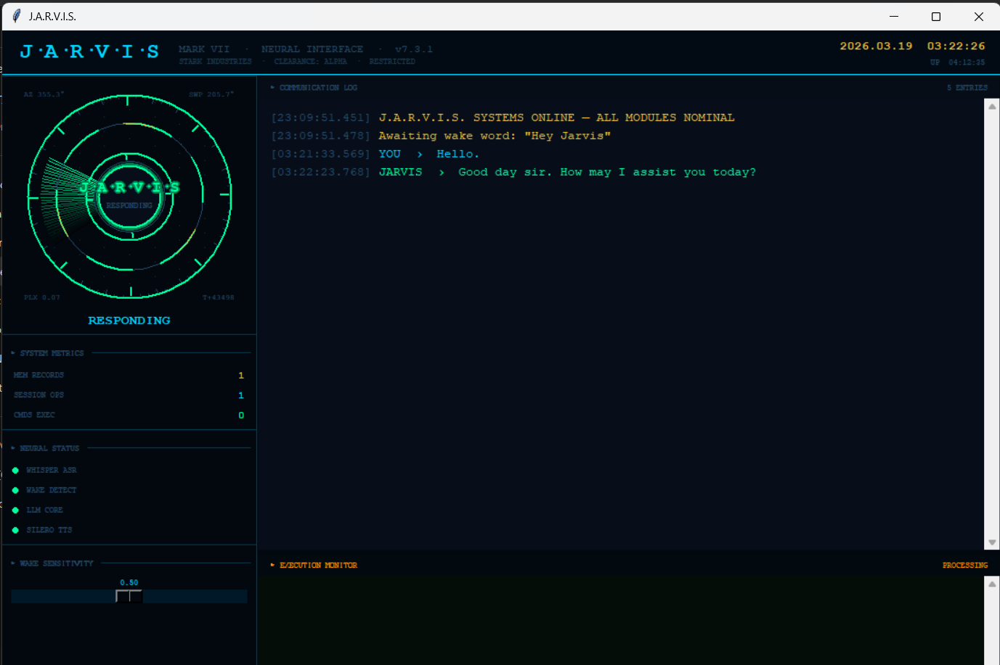

# J.A.R.V.I.S. Local Voice Assistant



A completely local, LLM-based voice assistant for Windows. Everything runs entirely on your own machine (no cloud APIs required).

## Architecture

This project glues together a few different local models to create a seamless voice assistant experience:
- **Wake Word Detection**: `openwakeword` (detects "Hey Jarvis")
- **Speech-to-Text**: `faster-whisper` (transcribes commands)
- **Text-to-Speech**: `silero-tts` (generates voice responses)
- **LLM Engine**: `ollama` running `qwen2.5:7b` (interprets commands and decides what tools to run)

## Features

- **Tool Execution**: The LLM is hooked up to several local system tools. It can:
  - Execute arbitrary CMD/PowerShell commands
  - Read/write/delete local files
  - Launch system applications
  - Perform web searches and open URLs
  - Play music (via YouTube search scraping or local file shuffle)
  - Take desktop screenshots
  - Control system volume
  - Set timers
  - Remember facts across sessions (saved to `jarvis_long_term_memory.txt`)
- **Reactive UI**: Built with Tkinter. Displays a core ring animation that reacts to audio input and visualizes current system state (listening, thinking, speaking).
    
- **Fast Startup**: Models like Whisper and OpenWakeWord are lazy-loaded or run in background threads, and Ollama gets a background "warmup" ping so the first spoken query is fast.

## Setup Requirements

1. **OS**: Windows (Some system tools are Windows-specific).
2. **Python**: 3.9+ recommended.
3. **Ollama**: Download from [ollama.com](https://ollama.com/) and ensure it's running in the background.

## Installation & Quick Start

### Method 1: The Easy Way (Pre-compiled Executable)
1. Install [Ollama](https://ollama.com/) and download the language model by opening your terminal and running:
   ```bash
   ollama pull qwen2.5:7b
   ```
2. Go to the **Releases** tab on the right side of this GitHub page and download **`main.exe`** (or `Jarvis.exe`).
3. Double-click the `.exe` to run the assistant! 

*(Note: The first time you launch the `.exe`, it will invisibly download about 200MB of critical voice models like Whisper and Silero in the background. Be patient if the UI takes a minute or two to pop up!)*

### Method 2: Running from Python Source (For Developers)

1. Ensure Ollama is installed and running the `qwen2.5:7b` model as described above.
2. Install the necessary Python (3.9+) packages:
   ```bash
   pip install -r requirements.txt
   ```
   *(Note: For faster Whisper/TTS performance, install the PyTorch version with CUDA support if you have an Nvidia GPU).*

3. Execute the main script:
   ```bash
   python main.py
   ```

- When the UI appears, say **"Hey Jarvis"**. Keep in mind the first launch might take a couple of minutes to download the Whisper/Silero/WakeWord models to your cache.
- Wait for the wake chime, then speak your command.
- The assistant will transcribe the audio, pass it to the local LLM, execute any tools the LLM requests, and speak back the result.

## Development Notes

If you want to add new tools:
1. Define a standard Python function in `main.py` with type hints and a clear one-line docstring.
2. Add the function name to the `ALL_TOOLS` list near the bottom of the file.
3. Update the `SYSTEM_PROMPT` examples to show the LLM when and how to use your new tool.
